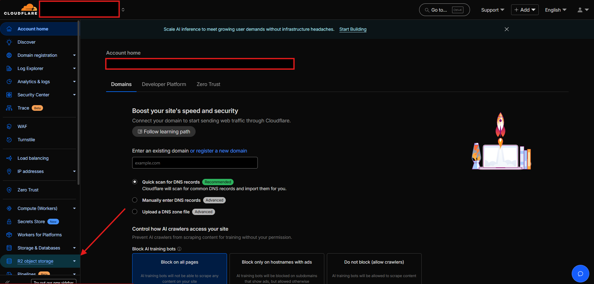
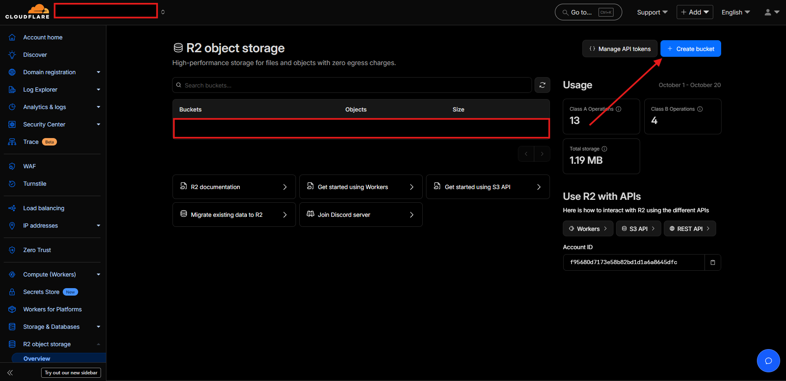
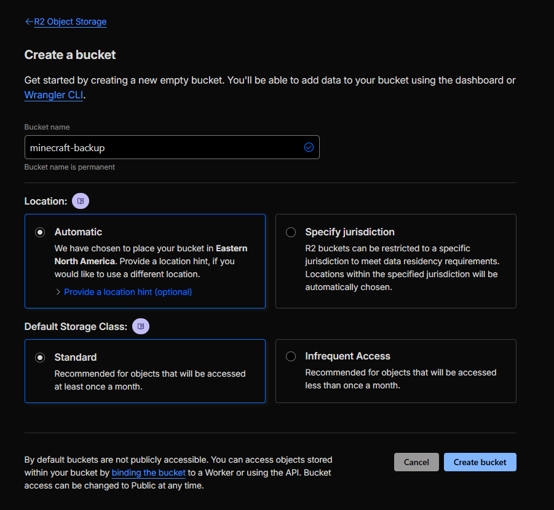
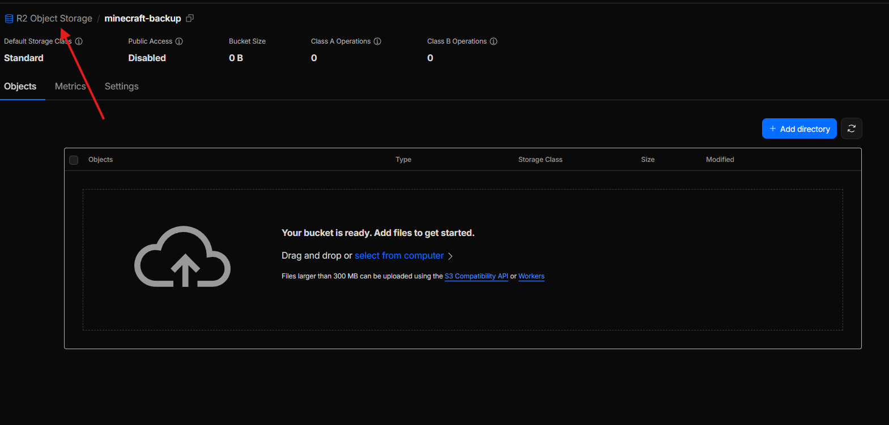

# world-savior
Using rclone to backup Minecraft world to Cloudflare to prevent losing ANOTHER world to pc upgrades. 

>**Platform:** Windows only

---

## Prerequisites
- A [Cloudflare R2](https://developers.cloudflare.com/r2/) bucket with:
    - Access key ID
    - Secret access key
    - Endpoint (e.g., `https://<YOUR-ACCOUNT-ID>.r2.cloudflarestorage.com`)
- [rclone](https://rclone.org/downloads/) downloaded and extracted
- Your Minecraft world folder (e.g., `C:/PATH/TO/YOUR/MINECRAFT/WORLD`)

- For auto backups you'll also need to download [mcrcon](https://github.com/Tiiffi/mcrcon/releases) 

---

## Setup Instructions

### 1. Create Cloudflare R2

#### Documentation for this can be found [here](https://developers.cloudflare.com/r2/)

1. [Create an Account](https://dash.cloudflare.com/sign-up)
2. Once logged in go to [R2 object storage](assets/r2-location.png)

3. Click [Create bucket](assets/Create-bucket-button.png). Name the bucket and press [Create bucket](assets/making-bucket.png)

4. Go back to [R2 Object Storage](assets/back-to-storage.png)

5. Now Click [Manage API tokens](assets/manage-api-btn.png)
6. Create [Account API token](assets/create-api-btn.png)
7. Change your Token name to whatever you'd like or keep the default
8. Change Permissions to allow OBJECT WRITE
9. Change Specify bucket(s) to : Apply to specific buckets only
10. Select the one you created then click Create
11. Leave the next page open for the steps to follow or store the information for later. And example of what the screen looks like can be found [here.](assets/api-info-screen.png) (Once you leave this screen you cant come back to it. You will need to make a new token if you don't have the information.)

---

## 2. Download and Prepare rclone

1. Download [rclone](https://rclone.org/downloads/) 
2. Extract all the files 
3. Make a new folder on your **Desktop** named `rclone`
4. Right-click that folder -> **Copy as path**.

---

1. Open **Command Prompt** 
2. Type: cd then right click it'll look something like cd "C:/Users/Owner/Desktop/rclone". Then press Enter 
3. Type: rclone config 
4. Make a new remote by pressing n 
5. It'll ask for remote name type cloudflare 
6. It'll then give a giant list of options type s3 
7. look for "Cloudflare R2 Storage" it should be number 6 make sure of this 
8. It'll ask for AWS credentials type: false 
9. It'll ask for an access key ID: <YOUR_R2_ACCESS_KEY_ID>
10. It'll then ask for secret access key: <YOUR_R2_SECRET_ACCESS_KEY> 
11. It'll ask for a region just type auto 
12. Next, It'll ask for and endpoint: <YOUR_ENDPOINT>
13. It'll ask if you want advanced config type n 
14. Keep this cloudflare remote? y 
15. Quit the config q

---
## 5. Running it by hand each time (make sure Server is off)
1. Make a folder on your **Desktop**
2. Name it server-backup
3. Copy and Paste your world folders to here (Make sure to not move from original location)
5. Open cmd and type cd ":/Path/to/your/Desktop/rclone
6. Run:
    - rclone copy "C:/Path/TO/YOUR/Desktop/server-backup" "cloudflare:your-bucket-name/minecraft-backup/world/todays date --progress --vv
        - replace "todays date" (e.g., mm-dd-yyy)

## 4. (Optional Recommended) Create auto backup instead
1. Go to [here](https://github.com/Tiiffi/mcrcon/releases).
2. Download **Windows 64-bit**
3. Extract the files and add mcrcon.exe to your rclone folder
4. Open your minecraft server folder open **server.properties**
    - Change **enable-rcon** to true
    - Change your **rcon.password** take note of what you change it to.
    - Take note or change **rcon.port**
5. download the file backup_with_rcon.bat and config.txt
6. Open ***config.txt** and change:
    - BASE_DIR = "C:/MinecraftServer" 
        - path to your minecraft server
    - REMOTE=cloudflare:your-bucket-name/minecraft_backups
        - cloudflare = name of your rclone remote
        - your-bucket-name = bucket name
        - minecraft_backups = optional subfolder inside the bucket

    - RCON_PASS change it to whatever your **server.properties** IS THESE MUST MATCH

    - **WORLDS** change this if mincraft adds more world files other then world, world_nether, and world_the_end by pressing space and then typing the name of the folder

